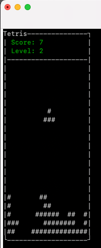
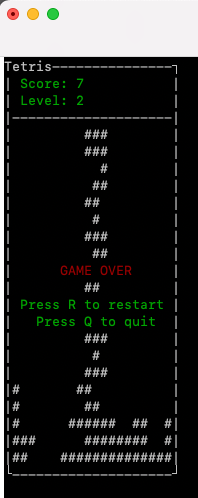

# Tetris

Jaroslav Fikar (fikarja3@fit.cvut.cz)

## Zadání a popis

Jedná se o remake klasické hry Tetris.

- Konzolové rozhraní (s použitím curses nebo podobné knihovny)
- Hlavní menu a stránka s ovládáním hry
- 5 základních tvarů dle originální hry
- Rotace útvaru v průběhu padání
- Možnost zrychlit padání útvaru
- Možnost hru pozastavit
- Rostoucí obtížnost během hraní — narůstající rychlost padání útvaru
- Ukládání nejvyššího dosaženého skóre

## Ukázka hry






## Spuštění

```bash
./tetris.rb
```

## Konfigurace

Uživatel má možnost změnit některé parametry (např. velikost obrazovky, znak pro vykreslení hry...) hry v
souboru [src/configuration.rb](src/configuration.rb).

## Ovládání

W - rotace / orientace v menu

S - zrychlené padání / orientace v menu

ENTER - výběr položky v menu

A - posun doleva

D - posun doprava

P - pozastavení hry

Q - ukončení hry

## Závislosti

- Curses (Vykreslování hry)
- Rspec (Testování)

### Instalace závislostí

```bash
bundle install
```

## Spuštění testů

Pro aplikaci jsem vytvořil několik rspec testů, které testují jednotlivé funkčnosti a chování aplikace.

### Vyhodnocení testů
```
rspec tests
```


## Možnosti rozšíření

Hra jako taková nabízí další možnosti rozšíření, například:

- Zdokonalit bodovací systém a levelování
- Přidat další typy tvarů
- Přidat tvarům barvy
- Možnost zobrazit náhled místa, kam tvar dopadne